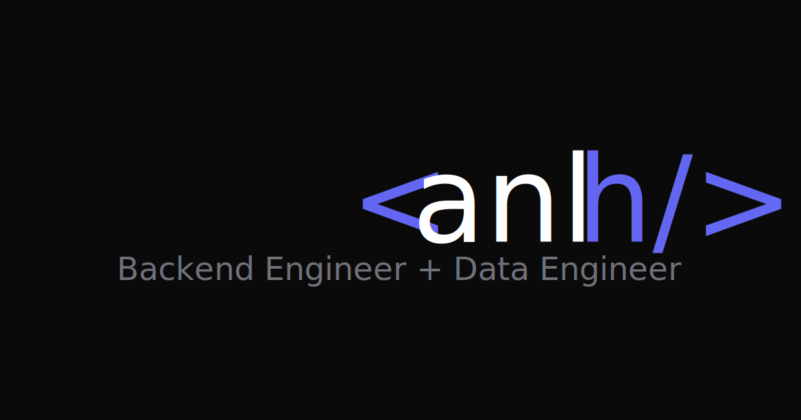

# Portfolio Personal - Alexis Labrador

> Data Analyst especializado en Backend & Data, Python, Django y automatización de procesos



## 📋 Descripción

Portfolio personal moderno y responsivo que muestra mi experiencia profesional, proyectos destacados, habilidades técnicas y formación académica. Diseñado con un enfoque en performance, accesibilidad y experiencia de usuario.

**URL del sitio:** *https://alexisnlh.github.io*

## ✨ Características

- **🎨 Diseño Moderno**: Interfaz limpia y profesional con animaciones sutiles
- **🌓 Modo Claro/Oscuro**: Toggle entre temas con preferencias guardadas en localStorage
- **📱 100% Responsive**: Diseñado mobile-first, se adapta a todos los dispositivos
- **⚡ Performance Optimizado**:
  - Imágenes optimizadas (reducción del 96.5%)
  - CSS variables para temas dinámicos
  - Lazy loading de animaciones con Intersection Observer
- **♿ Accesible**: Semántica HTML5, aria-labels, navegación por teclado
- **📊 Proyectos Detallados**: Modals con métricas de impacto y stack tecnológico
- **🎯 SEO Optimizado**: Meta tags, Open Graph, sitemap-ready

## 🛠️ Tecnologías Utilizadas

### Frontend
- **HTML5** - Estructura semántica
- **CSS3** - Variables CSS, Grid, Flexbox, Animaciones
- **JavaScript (ES6+)** - Vanilla JS, IIFE pattern, Intersection Observer

### Herramientas
- **Google Fonts** - Inter (sans-serif) y Fira Code (monospace)
- **SVG Icons** - Iconos inline optimizados
- **Git** - Control de versiones

## 📁 Estructura del Proyecto

```
portfolio_personal/
├── index.html                 # Página principal
├── css/
│   └── styles.css            # Estilos completos (~32KB)
├── js/
│   └── main.js               # Lógica y animaciones (~380 líneas)
├── assets/
│   ├── documents/
│   │   └── cv.html           # CV descargable (formato A4)
│   └── images/
│       ├── favicon.svg       # Icono del sitio
│       ├── og-image.svg      # Preview para redes sociales
│       ├── profile.jpg       # Foto de perfil (optimizada 31KB)
│       └── project-*.svg     # Ilustraciones de proyectos
└── README.md                 # Este archivo
```

## 🚀 Cómo Ejecutar Localmente

### Opción 1: Abrir directamente
1. Clona el repositorio:
   ```bash
   git clone https://github.com/alexisnlh/alexisnlh.github.io.git
   cd portfolio_personal
   ```

2. Abre `index.html` directamente en tu navegador

### Opción 2: Servidor local (recomendado)
```bash
# Python 3
python -m http.server 8000

# Python 2
python -m SimpleHTTPServer 8000

# Node.js (http-server)
npx http-server -p 8000
```

Luego abre `http://localhost:8000` en tu navegador.

## 📦 Deployment

### GitHub Pages
1. Sube el código a tu repositorio de GitHub
2. Ve a Settings > Pages
3. Selecciona la rama `main` y carpeta `/root`
4. Tu sitio estará disponible en `https://[tu-usuario].github.io/[nombre-repo]`

## 🎯 Secciones

1. **Hero** - Presentación inicial con animación de typing
2. **Sobre mí** - Experiencia, stack principal y estadísticas
3. **Experiencia** - Timeline de posiciones laborales
4. **Formación** - Educación académica y cursos
5. **Skills** - Lenguajes, frameworks, bases de datos y herramientas
6. **Proyectos** - 3 proyectos destacados con modals detallados
7. **Hobbies** - Intereses personales
8. **Contacto** - Links a redes y email

## 📄 Licencia

Este proyecto está bajo la licencia MIT. Ver el archivo `LICENSE` para más detalles.

## 👤 Autor

**Alexis Labrador**

- GitHub: [@alexisnlh](https://github.com/alexisnlh)
- LinkedIn: [@alexisnlh](https://linkedin.com/in/alexisnlh)

---

⭐ Si te gustó este portfolio, dale una estrella en GitHub!

*Diseñado y desarrollado con dedicación por Alexis Labrador - © 2026*
